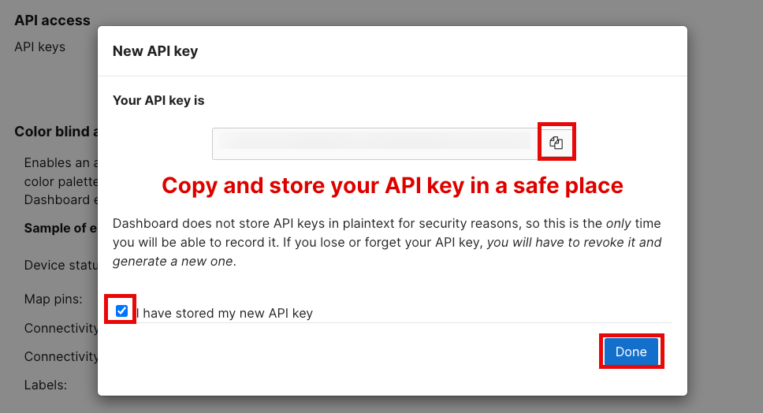
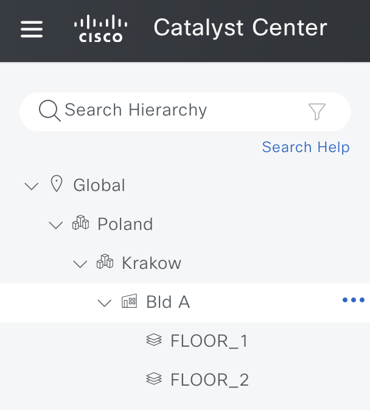
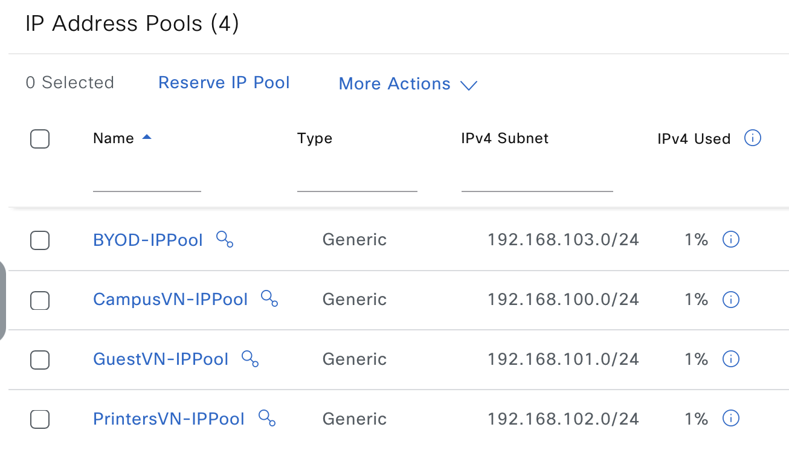
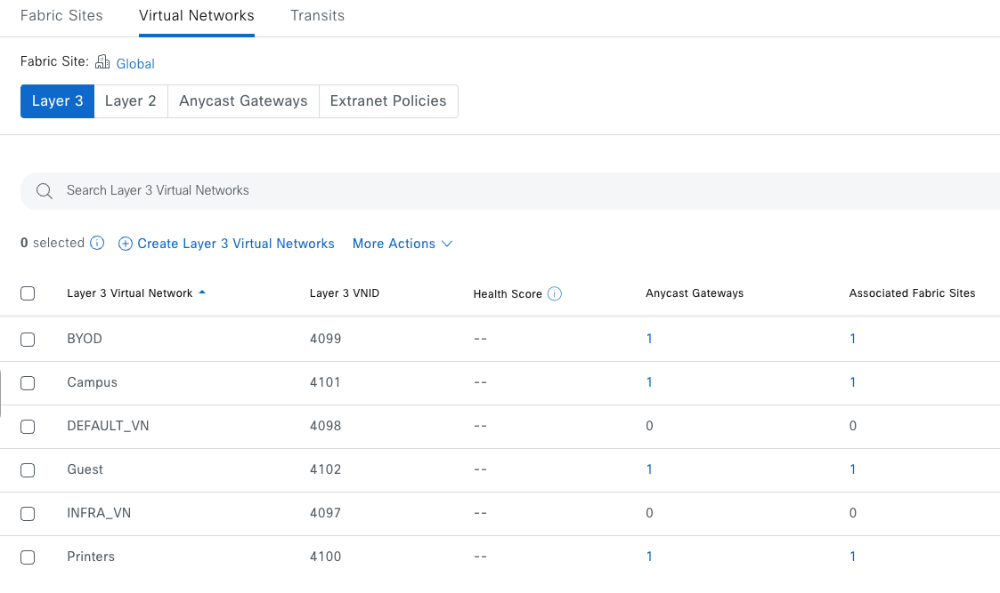
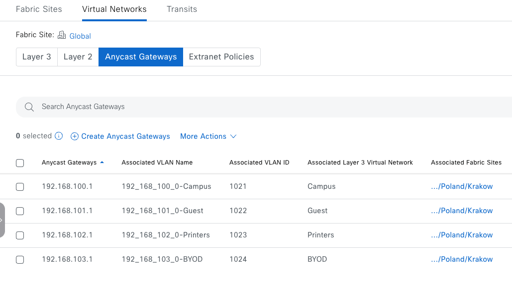
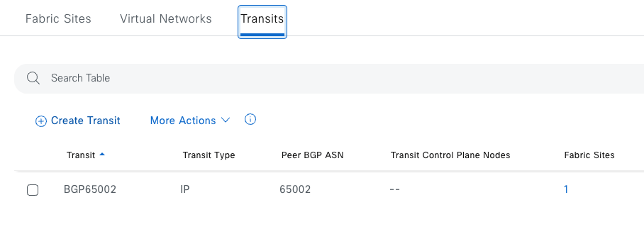
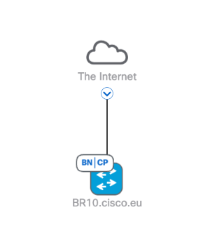
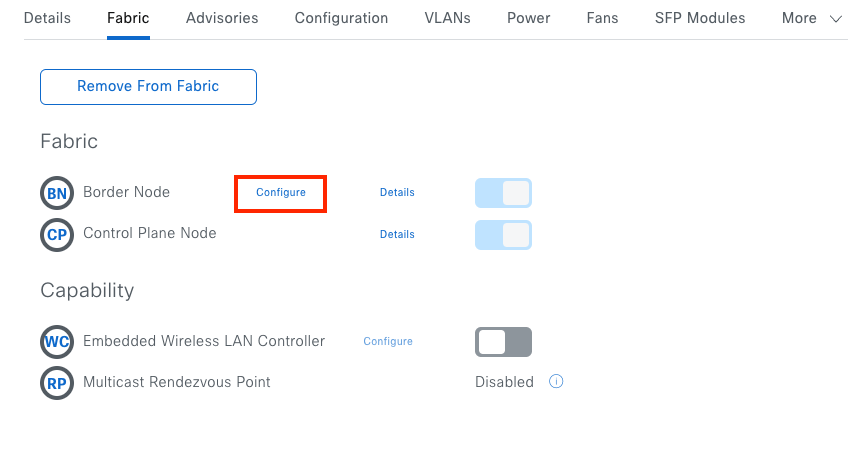
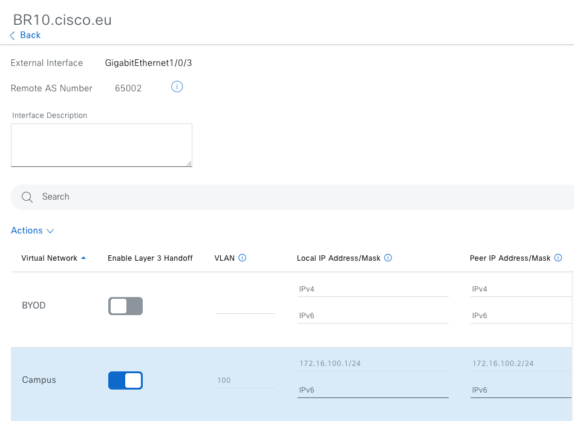
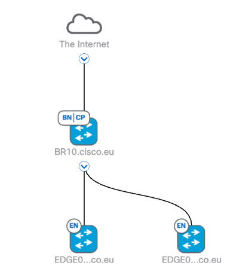

# NTT Workshop Lab Guide

Hands-on lab for deploying Cisco **Meraki Unified Branch** and **Catalyst Center SD-Access**
infrastructure using Network-as-Code (NaC), driven entirely through this repository's
GitHub Actions workflows. There is nothing to install locally — every step below runs on
GitHub-hosted runners, including the VPN tunnel used to reach the live Catalyst Center
controller.

## Table of contents

1. [Repository layout](#repository-layout)
2. [Fork & Prerequisites](#fork--prerequisites)
   - [One-time setup (per participant)](#one-time-setup-per-participant)
3. [Meraki Unified Branch](#meraki-unified-branch)
   - [A.1 Data model](#a1-data-model)
   - [A.2 Workflows](#a2-workflows)
   - [A.3 Deploy the Phase 1 network](#a3-deploy-the-phase-1-network)
   - [A.4 Explore syntax & semantic validation](#a4-explore-syntax--semantic-validation)
   - [A.5 Deploy two branches using templates](#a5-deploy-two-branches-using-templates)
   - [A.6 Scheduled integration tests](#a6-scheduled-integration-tests)
   - [A.7 Run the fully validated pipeline (optional)](#a7-run-the-fully-validated-pipeline-optional)
   - [A.8 Verifying in the Meraki Dashboard](#a8-verifying-in-the-meraki-dashboard)
   - [A.9 Tearing it down](#a9-tearing-it-down)
4. [Catalyst Center SD-Access](#catalyst-center-sd-access)
   - [B.1 Data model](#b1-data-model)
   - [B.2 Workflows](#b2-workflows)
   - [B.3 Deploy sites and IP pools](#b3-deploy-sites-and-ip-pools)
   - [B.4 Verify sites and IP pools have been created](#b4-verify-sites-and-ip-pools-have-been-created)
   - [B.5 Deploy the SD-Access Fabric](#b5-deploy-the-sd-access-fabric)
   - [B.6 Provision Border Device](#b6-provision-border-device)
   - [B.7 Provision Edge Devices](#b7-provision-edge-devices)
   - [B.8 Run the fully validated fabric pipeline](#b8-run-the-fully-validated-fabric-pipeline)
   - [B.9 Tearing it down](#b9-tearing-it-down)
5. [End of Lab](#end-of-lab)


## Repository layout

This repo hosts **two independent NaC solutions** side by side. Each is self-contained
(own Terraform root module, own data, own tests, own workflows) and can be run without
touching the other:

```
ntt-workshop-lab/
├── meraki/                     # Meraki Unified Branch (Branch-as-Code)
│   ├── main.tf                 # terraform-meraki-nac-meraki module (v0.9.0)
│   ├── .env.example            # template for non-secret org/serial variables
│   ├── schema.yaml, rules/     # nac-validate schema + custom semantic rules
│   ├── data-phase1/            # minimal 1-network data model (Phase 1 exercise)
│   ├── data/                   # full 2-branch data model (org, both networks, VPN hub)
│   └── tests/templates/        # Robot Framework nac-test templates
├── catalystcenter/              # Catalyst Center SD-Access (Network-as-Code)
│   ├── main.tf                 # netascode/nac-catalystcenter module (v0.4.1)
│   ├── data-phase1/             # sites + IP pools only (Phase 1 exercise)
│   ├── data/                   # full data model: sites, IP pools, fabric, devices
│   └── tests/templates/        # Robot Framework nac-test templates
└── .github/workflows/          # every deploy/destroy pipeline described below
```

> [!IMPORTANT]
> Both solutions deploy against **real, live infrastructure** in your own dCloud pod: a
> Meraki Dashboard organization and a Catalyst Center controller reachable only over a
> dCloud VPN tunnel that the workflow itself establishes at `https://198.18.129.100`.
>
> Every "Deploy" run changes real infrastructure state, and every "Destroy" will destroy the deployment. 


## Fork & Prerequisites

Each participant works from their **own fork** of this repo. Every participant has an
isolated pod (own Meraki organization, own dCloud Catalyst Center controller instance), so
sharing one repo's secrets and Terraform state across multiple people would mean
colliding applies against different pods with a single set of credentials.

### One-time setup (per participant)

1. **Access your Meraki Dashboard account (BYOA model).** This lab uses a
   **Bring Your Own Account (BYOA)** model — you use your own Meraki Dashboard account and
   your own API key throughout the lab. Cisco does not store or manage your credentials.
   - If the email you used for your lab reservation is associated with an existing
     Dashboard account, you should receive a notification that new **administrator
     privileges** have been granted to your account for the lab organization. Follow the
     instructions in that email to accept the invite.

     
   - If this is your first time accessing Meraki Dashboard with that email, the message
     instead guides you to create a password.

     
   - **Important:** if your Meraki Dashboard account is also associated with other
     organizations — especially production environments — do **not** perform any steps in
     this guide against your own organization. Only work within the provided lab
     organization, which follows the naming pattern **"Org-[org_id]"**.
2. **Fork this repo** into your own GitHub account:
   - Make sure you are logged in to GitHub, then navigate to the repo at
     [github.com/snmitrov/ntt-workshop-lab](https://github.com/snmitrov/ntt-workshop-lab).
   - Click **Fork** (top right of the repo page).
   - On the "Create a new fork" page, leave **Owner** set to your own account, keep the
     repository name as `ntt-workshop-lab` (or rename it if you prefer — the workflows
     don't care about the repo name), and leave **"Copy the main branch only"** checked
     (you don't need any other branches for this lab).
   - Click **Create fork**. You now have your own copy at
     `github.com/<your-username>/ntt-workshop-lab` with its own Actions, secrets, and
     Terraform state, completely independent of everyone else's fork.
   - You do not need to clone it locally — every step in this guide runs from the GitHub
     web UI (Actions tab) and, for the one edit in step 6 below, GitHub's web-based file
     editor. If you have a code editor such as VS Code available and prefer to work from
     there instead, that works too — clone your fork and push your changes to `main` as
     usual.
3.  :point_right: **Enable Actions on your fork.** GitHub disables Actions on forks by default — go to
    your fork's **Actions** tab and click "I understand my workflows, go ahead and enable
    them." The lab workflows will not run until this is done.
4. **Create the `ntt-workshop-lab` GitHub Environment** in your fork: **Settings →
   Environments → New environment**, named exactly `ntt-workshop-lab` (every workflow in
   this repo references that name — a typo here means every workflow fails to find its
   secrets).
5. **Add secrets to that environment** (**Settings → Environments → ntt-workshop-lab →
   Add secret**), using the credentials for *your own* pod:
   - `MERAKI_API_KEY` — your Meraki Dashboard API key. To generate it: log into the
     Meraki Dashboard using your account, open **Organization → Settings** and confirm "Enable
     API access" is turned on, then go to **your account profile → API access** (top
     right, click your name/email → "My profile") and click **Generate API key** (copy it
     immediately — Dashboard only shows it once). Do not share your API key with anyone.

     

     
   - `CC_PASSWORD` — your pod's Catalyst Center `admin` password.  You will get the password from the lab proctor. 
   - `CC_VPN_USERNAME` / `CC_VPN_PASSWORD` — your pod's dCloud AnyConnect VPN credentials. You will get credentials from the lab proctor. 

   The Catalyst Center URL (`https://198.18.129.100`) and username (`admin`) are hardcoded
   in `catalystcenter/main.tf` and identical across dCloud pods, so you don't need to
   change those.
6. **Create `meraki/.env`** in your fork with *your own* pod's values. This file is
   committed to the repo (not a secret) and is read straight into `$GITHUB_ENV` by every
   Meraki workflow, so it must reflect your pod:
   - `org_name` — your pod's Meraki organization name
   - `branch1_mx_serial` / `branch1_ms_serial` / `branch1_cw_serial` and the `branch2_*`
     equivalents — your pod's device serials
   - `vpn_hub_network_name` — must match the hub network name already preconfigured in
     your pod's Dashboard (typically `Datacenter`)

   **Where to find these values:**

   - Log into [dashboard.meraki.com](https://dashboard.meraki.com) with your pod's
     credentials and select your lab organization (`Org-<...>` — this is your `org_name`).
   - Open the **Datacenter** network, then go to **Network-wide → General** and scroll to
     the **Network notes** field.
   - You should see your lab organization name and serial numbers for branches in this
     format:

     ```
     #Copy and paste the following into .env of your git repository.
     org_name=Org-XXXXXXXXXXXXXXXXXXX

     # ── Device serials (per-branch)
     #
     branch1_mx_serial=XXXX-XXXX-XXXX
     branch1_ms_serial=XXXX-XXXX-XXXX
     branch1_cw_serial=XXXX-XXXX-XXXX
     branch2_mx_serial=XXXX-XXXX-XXXX
     branch2_ms_serial=XXXX-XXXX-XXXX
     branch2_cw_serial=XXXX-XXXX-XXXX
     ```

   Copy that block straight into `meraki/.env`, replacing the placeholder `org_name` and
   `branch*_*_serial` lines, instead of typing the serials by hand.

   The remaining values further down that file (`v3_auth_pass`, `radius_server_secret`,
   `snmp_passphrase`, etc.) are intentionally low-value example credentials for this lab
   environment, loaded the same way as the values above — leave them as-is unless your
   pod's data model needs different ones. Never put real production credentials in this
   file; anything that should stay confidential belongs in GitHub Secrets (step 5) instead.
7. **Commit the `meraki/.env` change** to your fork's `main` branch — workflows read it
   from the checked-out repo, so a local-only edit has no effect.


## Meraki Unified Branch

### A.1 Data model

The Meraki solution is driven by YAML under `meraki/` folder, consumed by the `terraform-meraki-nac-meraki` module. We will start by deploying simnge minimal network  (`NTT-Phase1-Network`) with appliance/switch/wireless product types, org-level login security and SNMPv3 settings, and one syslog target. 
Then we will deploy 2 branches using the templating function. This shows the flexibility of the solution and how you can use Network as Code templates to deploy repetitive configurations, such as branch offices.  
- `data/*.nac.yaml` — the full two-branch topology: **Unified Branch 1** and
  **Unified Branch 2**, each a small-branch site (MX appliance + MS switch + access
  point) with its own VLANs (10/20/30/40/50/999), dual-WAN uplinks, RADIUS-backed
  wireless (`Data` and `Guest` SSIDs), group policies, and a hub-and-spoke Auto VPN mesh
  back to a shared `vpn_hub_network_name` hub network.  
`organizations` entry lists `networks`; each network attaches a list of Meraki config
**templates** (`nw_setup`, `switch`, `wireless`, `app_fw`, …) and a `variables` block that
fills in the template placeholders — device serials, VLAN subnets, SSID names, RADIUS
servers, syslog/netflow targets, and so on. Anything sensitive is pulled in with an `!env`
tag (e.g. `appliance_01_serial: !env branch1_mx_serial`) so it never lives in the YAML
itself.  

  

### A.2 Workflows

For the purpise of this lab we have prepared few executable GitHub workflows. Identical functionality can be achieved with any CICD pipeline tool - such as Jenkins or GitLab. 

| Workflow (Actions tab name) | File | What it does |
|---|---|---|
| **Meraki Phase 1 Deploy Only** | `meraki-phase1-deploy.yml` | Plan + Deploy only, scoped to `data-phase1/` — creates just `NTT-Phase1-Network`. No validation or tests. |
| **Meraki Minimal Deploy Only** | `meraki-deploy-only.yml` | Plan + Deploy only, full `data/` — both Unified Branch networks + VPN hub. No validation or tests. |
| **Meraki Branch Deployment** | `meraki-pipeline.yml` | The full pipeline: `terraform fmt` + `nac-validate` → plan → deploy → idempotency check → `nac-test` integration tests → automatic cleanup on failure. |
| **Meraki Cleanup – Delete Branch Networks** | `meraki-destroy.yml` | Destroys everything Terraform currently manages for Meraki. Requires typing `destroy` into the `confirm` input. |
| **Reset Terraform State** | `reset-terraform-state.yml` | Clears the saved Terraform state for Meraki, Catalyst Center, or both. Use only when the lab design changes and you want to reuse the same fork with empty state files. Requires typing `reset` into the `confirm` input. |

All Meraki workflows share the same Terraform state (cache key
`terraform-state-meraki-<branch>`) and the same `${{ github.ref }}-meraki` concurrency
group, so they always queue safely behind one another even if dispatched close together —
you cannot accidentally run two conflicting Meraki applies at once.

### A.3 Deploy the Phase 1 network

1. **Examine the data model first.** In your fork, open
   [`meraki/data-phase1/phase1-network.nac.yaml`](meraki/data-phase1/phase1-network.nac.yaml)
   and read through it before deploying anything. Notice the `!env org_name` reference at
   the top (resolved from your fork's `meraki/.env`), the org-level `login_security` and
   `snmp` (v3) blocks, and the single `NTT-Phase1-Network` entry with its `product_types`,
   `tags`, and one `syslog_servers` target. 
2. Go to **Actions → Meraki Phase 1 Deploy Only → Run workflow** on the `main` branch.
3. Watch the **Plan** job — it merges `data-phase1/` into a single configuration and
   produces a Terraform plan artifact (`meraki-phase1-plan-outputs`).
4. Watch the **Deploy** job — it downloads that plan and applies it with
   `terraform apply plan.tfplan`. On success it uploads the resolved
   `meraki-phase1-terraform-state` artifact and saves a fresh state cache entry keyed by
   the run ID.
5. If `Deploy` fails, the job automatically runs `terraform destroy` for `data-phase1/`
   to roll back rather than leaving half-applied resources behind.

### A.4 Explore syntax & semantic validation  

Before moving on to the full two-branch topology, it's worth seeing what happens when the
data model is *wrong* — two dedicated workflows check this without touching live
infrastructure at all, so they're safe to break on purpose. We will do Syntac and Semantic check on Meraki workflow but the same logic would to Catalyst Center. 

**Syntax validation**

1. **Actions → Meraki Syntax Validation → Run workflow.** The `Syntax Validation` job runs
   `iac-validate -r rules data/org_global.nac.yaml -s schema.yaml`, checking the data
   against the Yamale schema in [`meraki/schema.yaml`](meraki/schema.yaml). This first run
   should pass cleanly — it's your baseline.
2. Open [`meraki/schema.yaml`](meraki/schema.yaml) and find the `organizations:` block.
   Change its `name` field from `str(min=1, max=128, required=False)` to
   <code>str(min=1, max=10 required=False)</code> — now any organization name longer than 10
   characters is a schema violation.
3. Commit the change to `main` (GitHub's web-based file editor works fine for this), then
   go back to **Actions → Meraki Syntax Validation → Run workflow** again — dispatch a
   fresh run rather than using "Re-run all jobs" on the old one, since that reuses the
   previous run's checked-out commit.
4. Confirm the run now fails, with a `::error::` annotation pointing at the organization
   name being too long. Download the `meraki-syntax-validate-output` artifact to see the
   full validator output.
5.  :bangbang: **Restore** `meraki/schema.yaml`'s `organizations.name` field back to `max=128` and
    commit again — leaving this broken would fail every later deploy workflow too.

Syntax checks are important because they catch invalid data model structure early. By
making syntax validation part of the deploy workflow, we prevent malformed configuration
from being attempted against the live device or controller.

**Semantic / business-rule validation**

1. From Actions, now run the Semantic workflow. **Actions → Meraki Semantic / Business Rule Validation → Run workflow.** The
   `Semantics Validate` job runs `iac-validate -r rules data/org_global.nac.yaml --non-strict`,
   which additionally loads the custom rule in
   [`meraki/rules/101_admin_name.py`](meraki/rules/101_admin_name.py). Open that file — its
   `match()` method walks every domain's `administrator.name` and flags any admin literally
   named `root` (severity `HIGH`). This baseline run should pass, since
   [`meraki/data/org_global.nac.yaml`](meraki/data/org_global.nac.yaml) currently has
   `administrator.name: admin`.
2. Edit `meraki/data/org_global.nac.yaml` and change `administrator.name` from `admin` to
   `root`, then commit to `main`.
3. Re-run **Meraki Semantic / Business Rule Validation** and confirm it now fails, with
   rule 101's message ("Admin name must not be 'root'") surfaced as a GitHub annotation.
   Download the `meraki-semantics-validate-output` artifact to see the full output.
4. :bangbang: **Restore** `administrator.name` back to `admin` and commit again.

Semantic rules are important because they verify the data model against business and
compliance requirements, not just YAML structure. They can enforce standards such as
network naming, subnet assignment, required tags, approved values, or any other rule an
organization needs before configuration reaches the live environment.

**Key takeaway:** these are exactly the same two `iac-validate` invocations that 
**Meraki Branch Deployment** (A.7 below) runs automatically before ever touching live
infrastructure — this is how a bad data model gets caught in the pipeline instead of
failing (or silently misconfiguring) a real apply.

### A.5 Deploy two branches using templates

In this section, we will use Network as Code for Meraki templates. This means we will use pre-created network templates, which in this lab match the Cisco Validated Design for Unified Branch, to deploy two branches while providing only a minimal set of configuration parameters.

1. **Examine the data model first.** Open
   [`meraki/data/pods_variables.nac.yaml`](meraki/data/pods_variables.nac.yaml) — this is
   where **Unified Branch 1** and **Unified Branch 2** are actually defined, each as a
   `templates` list plus a `variables` block (VLAN subnets, SSID names, device serials via
   `!env`, RADIUS servers, WAN uplink limits, the `hubs` entry pointing at
   `vpn_hub_network_name`). The `templates-*.nac.yaml` files alongside it
   (`templates-appliance.nac.yaml`, `templates-switch.nac.yaml`,
   `templates-wireless.nac.yaml`, etc.) are the reusable building blocks those `templates`
   lists reference — skim one or two to see how a template's placeholders line up with the
   `variables` block.
2. **Actions → Meraki Minimal Deploy Only → Run workflow.** In your fork, click the
   **Actions** tab at the top of the repo page, then click **Meraki Minimal Deploy Only**
   in the workflow list on the left. Click the **Run workflow** dropdown button (top right,
   above the list of runs), leave the branch set to `main`, and click the green
   **Run workflow** button to launch it.
3. Once the job finishes, navigate back to Meraki Dashboard to see the 2 networks - 
   **Unified Branch 1** and **Unified Branch 2** created. You can examine the configuration as needed. 

### A.6 Scheduled integration tests

Beyond one-off pipeline runs, this repo can also periodically re-test whatever is
*currently* deployed, to catch drift between the data model and the live Dashboard.

1. In your fork, click the **Actions** tab, select **Meraki Scheduled Integration Test**
   from the workflow list, and click **Run workflow**. Set `check_interval` to `once`.
   Other sample values (`1`, `6`, `12`, or `24` hours) are provided to demonstrate that
   you can run these tests periodically and check for drift from the desired
   configuration. Finally, click the green **Run workflow** button to launch it.
2. Once the workflow has executed, open the completed run and check the status of the
   **Integration Test** job. Download the `meraki-scheduled-integration-test-<run number>`
   artifact, extract it, and navigate to `test/results/meraki-integration-test-results`.
   Open `log.html` in your browser and examine the list of tests that were executed. Pay
   attention to the total time it took to execute the test suite.
3. **Optional drift exercise.** In the Meraki Dashboard, open Unified Branch 1's switch and
   change its MTU away from the `switch_mtu_size: 9176` defined in
   [`meraki/data/pods_variables.nac.yaml`](meraki/data/pods_variables.nac.yaml) (e.g. to
   `9000`) directly in the UI — bypassing Terraform entirely. Re-run
   **Meraki Scheduled Integration Test** with `check_interval: once`; the
   `networks_switch_mtu.robot` test should now fail, since it compares the live switch's MTU
   against the value baked into the data model. Restore the network to its expected state
   afterward, either by changing the MTU back in the Dashboard or by re-running one of the
   deploy workflows.


### A.7 Run the fully validated pipeline (optional)

Everything so far has been one piece at a time: syntax validation and semantic validation
in A.4, then a plain deploy in A.5. **Meraki Branch Deployment** is where it all comes
together — syntax validation, semantic validation, provisioning, and integration testing,
chained into a single automated run. It's the pipeline you'd actually trust before merging
a real change, and it's a nice way to see the whole story end to end in one go.

This step is entirely optional — feel free to skip ahead to A.8 if you're short on time.
What follows is simply a worked example of the complete flow.

1. **Data model.** This step deploys the same `meraki/data/` directory as Step 2 — worth
   re-opening [`meraki/data/pods_variables.nac.yaml`](meraki/data/pods_variables.nac.yaml)
   if you've changed anything since, since `nac-validate` will now catch mistakes in it
   before they reach live infrastructure.
2. **Actions → Meraki Branch Deployment → Run workflow.** In your fork, click the
   **Actions** tab at the top of the repo page, then click **Meraki Branch Deployment** in
   the workflow list on the left. Click the **Run workflow** dropdown button, leave the
   branch set to `main`, and click the green **Run workflow** button to launch it.
3. Watch the stages run in order: **Validate** (`terraform fmt -check` plus `nac-validate`
   — the same syntax and semantic checks from A.4, now run automatically) → **Plan** →
   **Deploy** → **Idempotency Test** (a **detailed-exitcode** re-plan that fails the run if
   Terraform still wants to change anything right after applying) → **Integration Test**
   (`nac-test` Robot Framework tests against the merged configuration, uploading a report
   artifact and a Job Summary). One trigger, the full pipeline.
4. If any stage after deploy fails, the `failure-cleanup` step destroys what was just
   created so the environment isn't left half-configured for the next run.

### A.8 Verifying in the Meraki Dashboard

Log into the lab organization's Meraki Dashboard and confirm, per network:

- **Network-wide → General**: correct time zone, tags, notes.
- **Security & SD-WAN → Appliance status**: MX shows dual-WAN uplinks, both green.
- **Switching → Switch ports**: MS switch present with the expected access/trunk config.
- **Wireless → SSIDs**: `Data` and `Guest` SSIDs broadcasting, RADIUS servers attached.
- **Security & SD-WAN → Site-to-site VPN**: branch shows as a spoke to the shared hub.

### A.9 Tearing it down

In your fork, click the **Actions** tab, select **Meraki Cleanup – Delete Branch Networks**
from the workflow list, and click **Run workflow**. In the `confirm` field, type `destroy`
exactly, then click the green **Run workflow** button to start the cleanup.

When the workflow completes, Terraform deletes every Meraki network currently tracked in
state, including Phase 1's `NTT-Phase1-Network` if it is still present. 


## Catalyst Center SD-Access

### B.1 Data model

The Catalyst Center solution is driven by YAML under `catalystcenter/data/` and
`catalystcenter/data-phase1/` for the minimal exercise, consumed by the
`netascode/nac-catalystcenter` module against the live controller at
`https://198.18.129.100`. 

The following configuration will be deployed:

- **Sites** (`sites.nac.yaml`): a hierarchy `Global → Poland → Krakow`, with a building
  (`Bld A`, geolocated in Krakow) and two floors (`FLOOR_1`, `FLOOR_2`) under it. The
  `Krakow` area also reserves four IP pools for later use.
- **IP pools / network settings** (`network_settings.nac.yaml`, referenced from
  `sites.nac.yaml` via `ip_pools_reservations`): 
   `CampusVN-IPPool`,   
   `GuestVN-IPPool`,  
   `PrintersVN-IPPool`,   
   `BYOD-IPPool` — one per virtual network.
- **Fabric** (`fabric.nac.yaml`): four L3 virtual networks:
  `Campus`,  
  `Guest`,  
  `Printers`,
  `BYOD`, 
  
   Further, BGP-based IP transit (`BGP65002`, AS 65002), a fabric site at
  `Global/Poland/Krakow` enabling all four VNs with anycast gateways bound to the IP
  pools above, and a border device (`BR10`) with a Layer 3 handoff into the transit.
- **Devices** (`devices.nac.yaml`): the inventory that fills in that fabric topology —
  `BR10`- as the border/control-plane node,  
  `EDGE01`/`EDGE02` as edge nodes, each with a port assignment onto the `Campus` VLAN with no 802.1X (`No Authentication` template).
- **Templates** (`templates.nac.yaml`, `templates/ACL_Block.j2`): day-N CLI templates
  pushed to devices, e.g. an ACL-blocking Jinja template.

`data-phase1/` contains only the site hierarchy and IP pool slice: `sites.nac.yaml`
defines the areas, building, floors, and site-level IP pool reservations, while
`ip_pools.nac.yaml` defines the parent pool and the four reserved IP pools. There is no
fabric and no device inventory yet, so it can be deployed and torn down quickly as a
warm-up exercise.

### B.2 Workflows

| Workflow (Actions tab name) | File | What it does |
|---|---|---|
| **CC Phase 1 Deploy Only** | `cc-phase1-deploy.yml` | Plan + Deploy only, scoped to `data-phase1/` — sites, building, floors, IP pool reservations. No validation or tests. |
| **CC Minimal Deploy Only** | `cc-deploy-only.yml` | Plan + Deploy only, full `data/` — sites, IP pools, fabric, devices, templates. No validation or tests. |
| **CC Fabric Deployment** | `cc-fabric-deployment.yml` | The full pipeline: `terraform fmt` + `nac-validate` (rules in `catalystcenter/rules/`, schema `schema.yaml`) → plan → deploy → idempotency check → `nac-test` integration tests with a Job Summary. |
| **CC Destroy** | `cc-destroy.yml` | Destroys everything Terraform currently manages for Catalyst Center. Requires typing `destroy` into the `confirm` input. **Cannot be undone.** |
| **Reset Terraform State** | `reset-terraform-state.yml` | Clears the saved Terraform state for Meraki, Catalyst Center, or both. Use only when the lab design changes and you want to reuse the same fork with empty state files. Requires typing `reset` into the `confirm` input. |

Every job that touches the live controller (Plan/Deploy/test jobs, not the standalone
Validate job) installs `openconnect`, connects to `dcloud-sjc-anyconnect.cisco.com` using
the `CC_VPN_USERNAME`/`CC_VPN_PASSWORD` secrets, waits for the tunnel to come up, and
explicitly checks reachability to `198.18.129.100` before running Terraform — the run
fails fast with a clear error if the VPN didn't connect, rather than timing out inside
Terraform. The VPN is always disconnected again in an `if: always()` step, whether the job
succeeded or not. All CC workflows share one `cc-*` state (restored/saved via the
`./.github/actions/tf-state-restore` / `tf-state-save` composite actions) and the
`cc-fabric-deployment`/`cc-deploy-only` concurrency groups, so — like Meraki — you can't
accidentally run two conflicting CC applies at once.

### B.3 Deploy sites and IP pools

1. **Examine the data model first.** Open
   [`catalystcenter/data-phase1/sites.nac.yaml`](catalystcenter/data-phase1/sites.nac.yaml)
   and read through it before deploying. Notice the `areas` hierarchy
   (`Global → Poland → Krakow`) and the `ip_pools_reservations` list under the Krakow
   site. Then open
   [`catalystcenter/data-phase1/ip_pools.nac.yaml`](catalystcenter/data-phase1/ip_pools.nac.yaml)
   to see the parent `Overlay` IP pool and the four reserved IP pools:
   `CampusVN-IPPool`,  
   `GuestVN-IPPool`, 
   `PrintersVN-IPPool`,  
   and `BYOD-IPPool`.  


2. In your fork, click the **Actions** tab, select **CC Phase 1 Deploy Only** from the
   workflow list, and click **Run workflow**. Leave the branch set to `main`, then click
   the green **Run workflow** button to launch it.
3. Watch the **Plan** job first. The workflow connects to the dCloud VPN, verifies that
   Catalyst Center is reachable, and creates a Terraform plan for the `data-phase1/`
   directory.
4. When **Plan** completes, watch the **Deploy** job. It reconnects the VPN, applies the
   saved plan, and stores the updated Terraform state so the next Catalyst Center workflow
   can continue from the same deployment.

### B.4 Verify sites and IP pools have been created

**Verify in the Catalyst Center UI**

1. Read the verification steps below before connecting to the VPN. Connecting the browser
   VPN may interrupt access to GitHub, including this lab guide. Once you understand the
   task, connect to the VPN, using provided credentials and, from your web browser, verify the deployed resources in
   Catalyst Center, then disconnect from the VPN and return to this guide.
2. Open the Chrome browser (or your VPN client's machine) and go to
   `https://198.18.129.100` (VPN required). Log in with the `CC_PASSWORD` secret you set
   earlier (username `admin`).
3. Go to **Design → Network Hierarchy** and confirm the `Global → Poland → Krakow` site
   tree is there, with building `Bld A` and its two floors underneath it. The tree view
   looks like this: 


   

4. Go to **Design → Network Settings → IP Address Pools** and confirm the four pools
   (`CampusVN-IPPool`, `GuestVN-IPPool`, `PrintersVN-IPPool`, `BYOD-IPPool`) are listed. The
   pools table looks like this:


   

### B.5 Deploy the SD-Access Fabric

In this step, you will extend the Phase 1 site and IP pool deployment into a full
SD-Access fabric. The workflow uses the complete Catalyst Center data model and adds the
fabric, virtual networks, transit, devices, and templates required to bring the topology
to life.

1. **Review the fabric data model.** Open
   [`catalystcenter/data/fabric.nac.yaml`](catalystcenter/data/fabric.nac.yaml) and
   [`catalystcenter/data/devices.nac.yaml`](catalystcenter/data/devices.nac.yaml). These
   are the main files added on top of the Phase 1 site and IP pool model.
   `fabric.nac.yaml` defines the four L3 virtual networks (`Campus`, `Guest`, `Printers`,
   `BYOD`), the `BGP65002` IP transit, the `Global/Poland/Krakow` fabric site, the anycast
   gateways, and the `BR10` border device Layer 3 handoff.
2. **Review the device and template inputs.** In `devices.nac.yaml`, notice how the
   inventory assigns `BR10` as the border/control-plane node and `EDGE01`/`EDGE02` as edge
   nodes, each with a port assignment onto the `Campus` VLAN. Note that all devices are in the `INIT` state before this deployment runs.
3. **Run the deployment workflow.** In your fork, open the **Actions** tab, select
   **CC Minimal Deploy Only** from the workflow list, and click **Run workflow**. Leave the
   branch set to `main`, then click the green **Run workflow** button to launch it.
4. **Watch the Plan and Deploy jobs complete.** This workflow follows the same Plan →
   Deploy flow as Phase 1, but it uses the full `data/` directory
   (`-var='yaml_directories=["data/"]'`) instead of only `data-phase1/`. When the run
   finishes successfully, Catalyst Center has the full SD-Access fabric model applied on
   top of the Phase 1 sites and IP pools.

**Verify the SD-Access fabric in Catalyst Center**

1. On the Catalyst Center [GUI](https://198.18.129.100/) go to **Provision → SD-ACCESS**, select    **Virtual Networks**, and confirm the Layer 3
   virtual networks (`Campus`, `Guest`, `Printers`, `BYOD`) are present. The virtual
   networks view looks like this:


   

4. In **Virtual Networks**, verify that the anycast gateways are created and associated
   with the correct IP pools. The anycast gateways view looks like this:


   

5. Select **Transits** and verify that the IP-Based Transit is present. The transits view
   looks like this:


   


### B.6 Provision Border Device

With the base SD-Access fabric configuration applied, you can now provision the border
device. In this step, you will change the device state for `BR10.cisco.eu` from `INIT` to
`PROVISION`, commit the change, and run the **CC Minimal Deploy Only** workflow again.

1. Open [`catalystcenter/data/devices.nac.yaml`](catalystcenter/data/devices.nac.yaml) and
   find the `BR10` device entry.
2. Change the `state` value from `INIT` to `PROVISION`:

   ```yaml
   catalyst_center:
     inventory:
       devices:
         - name: BR10
           fqdn_name: BR10.cisco.eu
           device_ip: 198.18.130.10
           pid: C9KV-UADP-8P
           state: PROVISION
           device_role: BORDER ROUTER
           site: Global/Poland/Krakow/Bld A
           fabric_site: Global/Poland/Krakow
           fabric_roles:
             - BORDER_NODE
             - CONTROL_PLANE_NODE
   ```

3. Commit the change to your fork's `main` branch.
4. In your fork, open the **Actions** tab, select **CC Minimal Deploy Only**, and click
   **Run workflow**. Leave the branch set to `main`, then click the green
   **Run workflow** button.
5. In the **Plan** job you review the resources Terraform intends to add. Even though
   you changed only one line in the YAML file, the workflow should plan the border device
   provisioning actions:

   - The `BORDER ROUTER` role is assigned to the device.
   - The border device is provisioned to the site.
   - The fabric device roles `BORDER_NODE` and `CONTROL_PLANE_NODE` are assigned.
   - The Layer 3 handoff for the `Campus` virtual network is created.
   - A wait step gives Catalyst Center time to synchronize the device in the UI.

6. When the **Deploy** job completes successfully, allow a few minutes for Catalyst Center
   to finish synchronizing the border device.

**Verify the border device in Catalyst Center**

1. Connect to the VPN, then open the Catalyst Center
   [GUI](https://198.18.129.100/) in your browser and log in as `admin`.
2. Go to **Provision → SD-ACCESS → Fabric Sites**, select the `Krakow` fabric site, and
   open the **Fabric Infrastructure** tab. Confirm that `BR10.cisco.eu` is visible:


   

3. Click the `BR10.cisco.eu` icon, select the **Fabric** tab, and click **Configure**:


   

4. Expand the `BGP65002` transit, click `GigabitEthernet1/0/3` under **External
   Interface**, and verify the Layer 3 handoff:


   


### B.7 Provision Edge Devices

After the border device is provisioned, provision the two edge devices. In this step, you
will change the device state from `INIT` to `PROVISION` for `EDGE01.cisco.eu` and
`EDGE02.cisco.eu`, then run the same deployment `CC Minimal Deploy Only` workflow again.

1. Open [`catalystcenter/data/devices.nac.yaml`](catalystcenter/data/devices.nac.yaml) and
   find the `EDGE01` and `EDGE02` device entries.
2. Change both edge devices from `state: INIT` to `state: PROVISION`:

   ```yaml
   catalyst_center:
     inventory:
       devices:
         - name: EDGE01
           fqdn_name: EDGE01.cisco.eu
           device_ip: 198.18.130.1
           pid: C9KV-UADP-8P
           state: PROVISION
           device_role: ACCESS
           site: Global/Poland/Krakow/Bld A
           fabric_site: Global/Poland/Krakow
           fabric_roles:
             - EDGE_NODE
           port_assignments:
             - interface_name: GigabitEthernet1/0/2
               connected_device_type: "USER_DEVICE"
               data_vlan_name: "192_168_100_0-Campus"
               authenticate_template_name: "No Authentication"
         - name: EDGE02
           fqdn_name: EDGE02.cisco.eu
           device_ip: 198.18.130.2
           pid: C9KV-UADP-8P
           state: PROVISION
           device_role: ACCESS
           site: Global/Poland/Krakow/Bld A
           fabric_site: Global/Poland/Krakow
           fabric_roles:
             - EDGE_NODE
           port_assignments:
             - interface_name: GigabitEthernet1/0/3
               connected_device_type: "USER_DEVICE"
               data_vlan_name: "192_168_100_0-Campus"
               authenticate_template_name: "No Authentication"
   ```

3. Commit the change to your fork's `main` branch.
4. In your fork, open the **Actions** tab, select **CC Minimal Deploy Only**, and click
   **Run workflow**. Leave the branch set to `main`, then click the green
   **Run workflow** button.
5. In the **Plan** job you review the resources Terraform intends to add. Similar to
   the border device step, this small YAML change causes several device provisioning
   actions:

   - The `ACCESS` role is assigned to the edge devices.
   - The edge devices are provisioned to the site.
   - The fabric device role `EDGE_NODE` is assigned to each edge device.
   - Port assignments are configured on the host-facing interfaces, with the data VLAN set
     to the `Campus` VLAN.

6. When the **Deploy** job completes successfully, verify that `EDGE01.cisco.eu` and
   `EDGE02.cisco.eu` are visible in Catalyst Center. Navigate to
   **Provision → SD-ACCESS → Fabric Sites**, choose the `Krakow` fabric site, and open the
   **Fabric Infrastructure** tab:


   


### B.8 Run the fully validated fabric pipeline

At this point, the SD-Access fabric should already be deployed. In this step, you are not
making any additional configuration changes. Instead, you will run the full production-style
pipeline to prove that the current data model is valid, that Terraform detects no new
changes, and that the automated integration tests pass against the live Catalyst Center
deployment.

1. In your fork, open the **Actions** tab, select **CC Fabric Deployment**, and click
   **Run workflow**. Leave the branch set to `main`, then click the green
   **Run workflow** button.
2. Open the **Plan** job and confirm that Terraform does not detect any configuration
   changes. Because you are running the pipeline against the fabric that was already
   deployed in the previous steps, the plan should show no infrastructure changes to add,
   update, or destroy.
3. Let the **Deploy** job complete. Since the plan contains no changes, this job confirms
   that the saved plan can be applied cleanly.
4. Confirm that the **Idempotency Test** job passes. This job runs another Terraform plan
   with `-detailed-exitcode`. Exit code `0` means the deployment is stable and Terraform
   sees no drift; exit code `2` means Terraform still sees changes and the pipeline fails.
5. Open the completed workflow run and download the integration test artifact. Extract the
   artifact locally and open the Robot Framework report files, such as `log.html` and
   `report.html`, in your browser.
6. Review the automated test results. Confirm which tests ran, verify that they passed,
   and inspect any failure details if the report shows failed or skipped tests.

### B.9 Tearing it down

1. In your fork, open the **Actions** tab and select **CC Destroy** from the workflow list.
2. Click **Run workflow**.
3. In the `confirm` field, type `destroy` exactly.
4. Leave the branch set to `main`, then click the green **Run workflow** button.
5. Watch the workflow complete and confirm that the destroy job finishes successfully.

> [!WARNING]
> This action cannot be undone. Re-running a deploy workflow afterward rebuilds the
> Catalyst Center configuration from the YAML data model.

## End of Lab

You have reached the end of the lab. Thank you.

